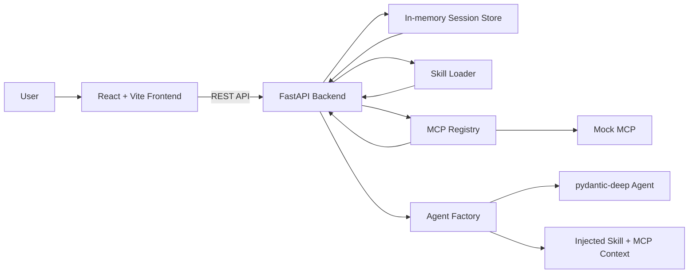

# DeepAgents Web Console

一个基于 `pydantic-deep` 的 Web 智能体控制台，支持对话、Skill 管理、MCP 配置展示、Session 管理和可视化调试。

## 1. 项目简介

这是一个面向技术面试题的最小可运行实现，目标是验证 `pydantic-deep` 在“Agent + Skill + MCP + Session + 前端控制台”场景中的实际可用性。

项目包含：

- Python 后端
- React 前端
- 本地 Skills
- MCP 配置与 mock 演示
- 内存 Session 管理
- 基础测试

## 2. 技术选型说明

### FastAPI

- 适合快速搭建清晰的 HTTP API
- 内置请求校验和 OpenAPI 文档
- 便于把 Session、Skill、MCP、Chat 拆成独立接口

### pydantic-deep

- 这是本题核心要求
- 提供 `create_deep_agent(...)` 作为 Agent 构建入口
- 原生支持 skills、mcp_servers、memory、history 等能力
- 便于用最少代码验证 DeepAgents 的真实可用性

### React

- 适合快速搭建交互型控制台
- 组件化清晰，便于把 Skills、Chat、MCP、Logs 分区展示
- 不需要复杂路由或全局状态管理

### Vite

- 启动快，配置轻
- 适合小型前端控制台
- 与 React + TypeScript 组合简单直接

## 3. 系统架构图



## 4. 项目目录结构

```text
project/
├─ backend/
│  ├─ app/
│  │  ├─ api/
│  │  ├─ agents/
│  │  ├─ core/
│  │  ├─ services/
│  │  ├─ sessions/
│  │  └─ skills/
│  ├─ config/
│  ├─ tests/
│  ├─ requirements.txt
│  ├─ pytest.ini
│  └─ .env.example
├─ frontend/
│  ├─ src/
│  ├─ index.html
│  ├─ package.json
│  ├─ tsconfig.json
│  └─ vite.config.ts
└─ README.md
```

## 5. 核心能力说明

### Agent

- 使用 `pydantic_deep.create_deep_agent(...)`
- 默认使用 `TestModel`，无需外部 Key 也能跑通
- 每次请求都会注入：
  - 基础 system prompt
  - 当前启用 Skills
  - 当前可用 MCP 信息
  - 当前 Session 历史

### Skill

- 本地 Skill 存在于 `backend/app/skills/`
- 每个 Skill 一个目录，一个 `SKILL.md`
- 支持发现、解析、展示、启用/禁用
- 当前实现为 prompt 注入方案

### MCP

- 支持 `backend/config/mcp.json`
- 支持查看服务器状态和工具列表
- 默认提供 `mock-server`，无需真实 MCP Server 也能演示
- 预留 `stdio / http / sse` 配置兼容

### Session

- 使用内存存储
- 支持创建、重置、保存 `active_skills`
- 支持多轮对话
- Session 历史会参与后续对话上下文

### Frontend

- 三栏 + 底部布局
- 左侧 Skills
- 中间 Chat
- 右侧 MCP
- 底部 Logs / Session 信息
- 使用 loading 状态表示执行过程

## 6. Skill 设计

Skill 采用目录化组织：

```text
backend/app/skills/
├─ code-review/
│  └─ SKILL.md
├─ test-generator/
│  └─ SKILL.md
└─ data-analysis/
   └─ SKILL.md
```

`SKILL.md` 使用统一 frontmatter：

```md
---
name: code-review
description: Review source code and find correctness, maintainability, and testing issues.
tags:
  - code
  - review
  - quality
---
```

后端会扫描目录、解析元数据、校验字段，并把启用的 Skill 内容注入 Agent prompt。

## 7. MCP 设计

MCP 配置文件：`backend/config/mcp.json`

当前策略：

- 默认启用 `mock-server`
- 用于演示 MCP 配置、状态和工具清单
- `enabled=false` 时状态会变为 `offline`
- 保留 `stdio / http / sse` 扩展空间

mock 工具示例：

- `search_docs`
- `analyze_text`

## 8. API 列表

- `POST /api/sessions`
- `GET /api/sessions/{id}`
- `POST /api/sessions/{id}/reset`
- `POST /api/sessions/{id}/skills`
- `GET /api/skills`
- `GET /api/mcp/servers`
- `GET /api/mcp/tools`
- `POST /api/mcp/reload`
- `POST /api/chat`

## 9. 本地启动方式

### 后端

```bash
cd backend
pip install -r requirements.txt
uvicorn app.main:app --reload --port 8000
```

### 前端

```bash
cd frontend
npm install
npm run dev
```

前端默认代理到 `http://127.0.0.1:8000`。

## 10. 测试方式

后端测试：

```bash
cd backend
python -m pytest -q
```

当前已覆盖：

- Skill 自动发现
- Skill 元数据解析
- 非法 Skill 报错
- Agent 创建
- Skill prompt 注入
- MCP 配置加载
- MCP enabled 状态
- Mock MCP 工具返回
- Session 创建 / 重置 / active_skills 保存

## 11. 验收结果

| 招聘要求 | 当前实现 | 是否满足 |
| ---- | ---- | ---- |
| Agent | 使用 `pydantic-deep` 创建 Agent，支持多轮对话 | 是 |
| Skill | 3 个本地 Skill，支持扫描、展示、启用 | 是 |
| MCP | 配置、状态、工具列表、reload、mock 演示 | 是 |
| Session | 创建、重置、历史保留、active_skills | 是 |
| Frontend | Skills / Chat / MCP / Logs 控制台 | 是 |
| README | 面向面试官的项目说明与验收说明 | 是 |
| Tests | pytest 覆盖核心能力 | 是 |

## 12. 已知限制

- MCP 当前为 mock 演示方案，未实现真实 MCP 工具调用链
- Skill 当前为 prompt 注入方案，不是运行时动态插件系统
- 前端使用 loading 状态替代流式输出
- Session 使用内存存储，重启后会丢失

